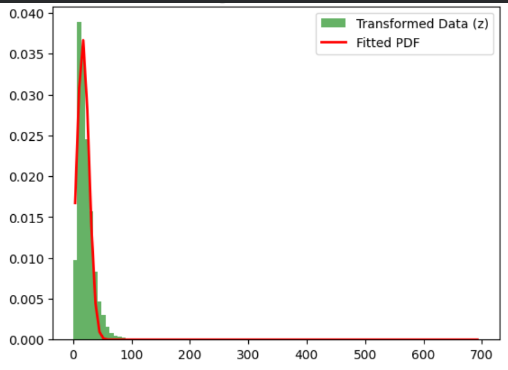

# Learn Probability Density Functions using Roll-Number-Parameterized Non-Linear Model

## 📌 Project Overview
This assignment focuses on estimating the parameters of a specific Probability Density Function (PDF) using **NO₂ air quality data**. The raw data is first transformed using a non-linear equation parameterized by my University Roll Number, and then fitted to a Gaussian distribution model.

* **Student Name:** Saniya Jindal
* **Student Roll Number:** 102303183

---

## 📂 Dataset
The dataset used is the **India Air Quality Data**, specifically focusing on the `NO2` concentration values.

* **Source:** [Kaggle - India Air Quality Data](https://www.kaggle.com/datasets/shrutibhargava94/india-air-quality-data)
* **Feature Selected:** `no2` column

---

## ⚙️ Methodology

### 1. Non-Linear Transformation
Transformation equation used: $z = x + a_r \sin(b_r x)$

**Parameters for Roll Number 102303183:**
- $a_r = 0.1$
- $b_r = 1.2$

### 2. Parameter Estimation
The transformed data ($z$) was modeled using: $\hat{p}(z) = c \cdot e^{-\lambda(z-\mu)^{2}}$

---

## 📊 Results
| Parameter | Symbol | Estimated Value |
| :--- | :---: | :--- |
| **Mean** | $\mu$ | [Fill from Code] |
| **Lambda** | $\lambda$ | [Fill from Code] |
| **Constant** | $c$ | [Fill from Code] |

---

## 📜 License
This project is licensed under the MIT License - see the [LICENSE](LICENSE) file for details.
Copyright (c) 2026 Saniya Jindal
